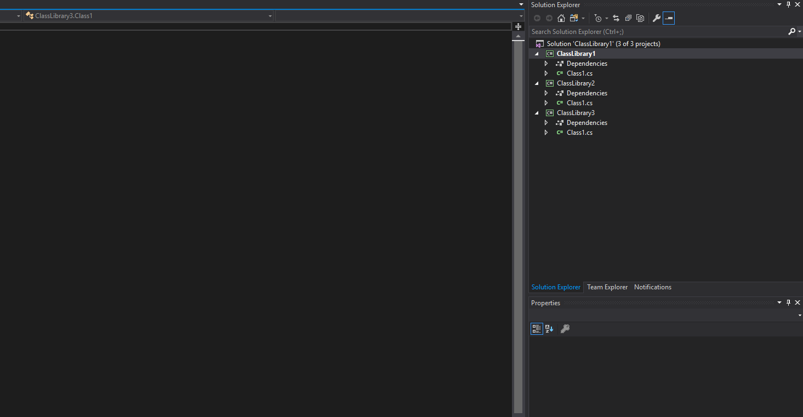

# [ProjectRefs](https://marketplace.visualstudio.com/items?itemName=iron9light.ProjectRefs)

(The icon is from [vscode-icons](https://github.com/vscode-icons/vscode-icons/blob/master/icons/file_type_dependencies.svg))

ProjectRefs is a Visual Studio extension.

Adds transitive project references to "refs" solution folder and remove unused project references automatically.

It is inspired by [Add Project References To Solution](https://marketplace.visualstudio.com/items?itemName=MohitC.AddProjectRefsToSolution3a2)

## How to use

It will analyze dependency graph and add/remove reference projects

- after solution opened
- after  Save All.

